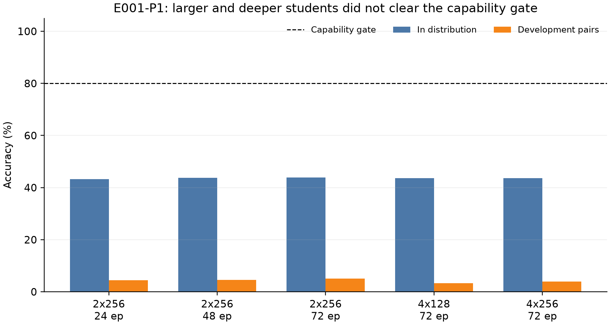
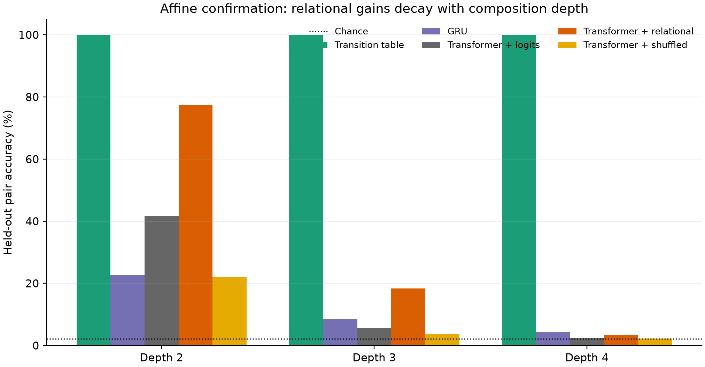
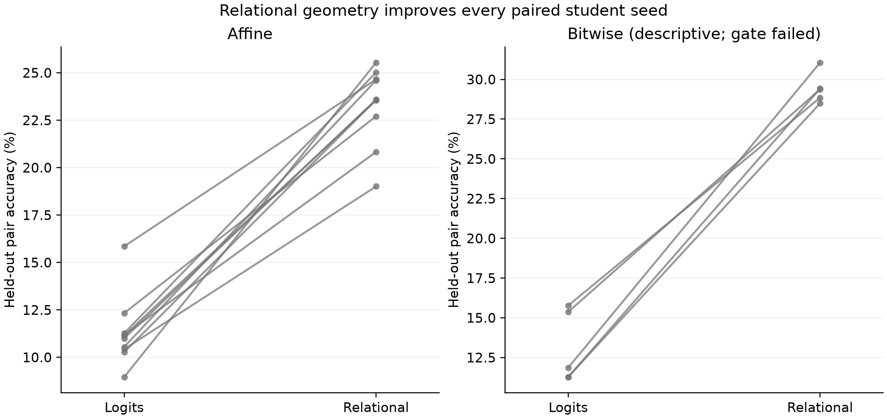
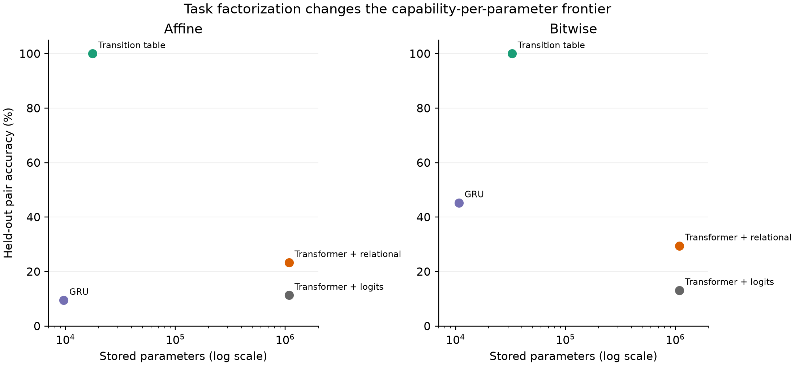

# Relational Activation Distillation Transfers Local Structure but Not an Iterative Algorithm

## A preregistered synthetic study of geometry, compositional depth, and task-aligned parameter reuse

**Alireza Afshan**

Independent researcher

18 August 2026

## Abstract

Can the geometry of a model's internal activation trajectory transfer useful computation to a smaller model, and is such transfer an efficient substitute for the right computational structure? We test these questions on finite-state composition tasks where every example specifies a start entity and a sequence of relations. The target is the entity obtained by repeatedly applying those relations. Our relational distillation objective matches normalized, centered Gram matrices of teacher and student states, making the target invariant to orthogonal changes of hidden-state basis. In a prospectively registered affine-permutation confirmation with ten paired student seeds, a generic Transformer trained with teacher logits plus relational geometry reached 23.31% held-out-pair accuracy, compared with 11.30% for logits alone and 6.65% for shuffled teacher geometry. The paired relational-minus-logits effect was 12.01 percentage points (95% CI [10.16, 13.86]). Yet the benefit decayed sharply with composition depth: depth-four accuracy was 3.51%, only 1.38 points above 2.13% chance, and failed our preregistered algorithm-transfer criterion. A task-aligned transition-table executor reached 100% at every depth using 17,672 stored parameters, versus 1,082,927 for the Transformer: 61.3 times fewer stored parameters and about 490 times fewer context-selected parameters per step. A fixed bitwise replication showed the same descriptive ordering, but its teacher scored 89.21% at depth four and missed the registered 95% positive-control gate; we therefore do not count that cell as confirmatory evidence. The results support a narrow conclusion: activation geometry carries transferable local relational information, but this objective did not transmit a depth-general iterative algorithm. On this bounded domain, explicitly representing context-selected transitions altered capability per parameter far more than adding richer teacher supervision.

## 1. Introduction

Modern neural networks store large amounts of capability in fixed weights, then create input-dependent activation trajectories at inference time. Those trajectories are attractive compression targets. If two trajectories differ systematically across inputs, it is natural to suspect that the differences encode something useful beyond an arbitrary internal coordinate system. Knowledge distillation provides an operational test: expose a smaller student to selected information from a larger teacher and ask whether held-out behavior improves.

The strongest version of this intuition would be consequential. If internal dynamics specify reusable computation more directly than final outputs do, transferring them might improve capability per parameter. It might also help explain why a large fixed network can produce many context-dependent computations without changing its weights. But a more skeptical possibility is equally plausible: a trajectory is meaningful only together with the teacher's weights, and forcing another architecture to imitate its geometry may transfer superficial correlations rather than the underlying algorithm.

This paper separates three questions that are often blended together:

1. **Coordinate question.** Is any benefit tied to the teacher's particular hidden basis, or can basis-invariant relations among states transfer?
2. **Algorithm question.** Does an activation objective transfer an iterative computation that extrapolates through greater composition depth, or only local regularities?
3. **Efficiency question.** How does richer supervision compare with an architecture that directly represents context-selected parameter reuse?

We study synthetic finite-state transition systems because they make these questions falsifiable on consumer hardware. Each relation is a permutation of a finite entity set. A model receives a start entity and two to four relation tokens, and must predict the result of sequentially applying the corresponding permutations. Some ordered relation pairs are withheld from student training. This design lets us distinguish memorizing familiar local combinations from repeatedly executing a primitive transition rule.

Our trajectory target is a normalized centered Gram matrix over the intermediate states in each minibatch. It retains pairwise inner-product geometry while discarding any privileged orthogonal basis. We compare label supervision, teacher logits, pointwise hidden-state matching, relational matching, shuffled trajectories, fixed random targets, and an untrained teacher. We also compare a generic Transformer with a GRU and a deliberately structured transition-table executor.

The empirical result is useful precisely because it is mixed. Relational geometry produces a large, seed-consistent improvement over logits and stringent geometry controls in the registered affine task. That result argues against the claim that all activation structure is meaningless without the teacher's weights. However, accuracy falls toward chance as depth increases, so the transferred information is not sufficient evidence of a learned iteration rule. The compact transition executor solves the task exactly because its architecture factors the problem into relation-selected state transitions and repeated application. It is an existence proof about task structure, not a proposal for replacing language models.

Our contributions are:

- a basis-invariant relational activation objective with matched shuffled, random, and untrained-teacher controls;
- a prospectively registered ten-seed confirmation showing local compositional transfer but rejecting a stronger algorithm-transfer criterion;
- a distinction among stored parameters, context-selected active parameters, and reuse across computation steps;
- a 61.3-fold stored-parameter comparison demonstrating the leverage, and the limitations, of encoding the correct finite-state factorization;
- a transparent failed replication gate that prevents a descriptively favorable second task family from being counted as confirmation; and
- an end-to-end reproducible workflow containing preregistrations, frozen configurations, raw per-seed results, analysis code, and a public draft manuscript.

## 2. Related work

### 2.1 Knowledge distillation and internal relations

Classical knowledge distillation trains a student against a teacher's softened output distribution rather than hard labels alone ([Hinton, Vinyals, and Dean, 2015](https://arxiv.org/abs/1503.02531)). Later work transfers relations among examples or representations. Relational Knowledge Distillation matches distances and angles among learned examples ([Park et al., 2019](https://arxiv.org/abs/1904.05068)), while similarity-preserving distillation transfers pairwise activation similarities ([Tung and Mori, 2019](https://arxiv.org/abs/1907.09682)). Our objective belongs to this family, but applies the same idea to states indexed by computation step and explicitly tests whether gains persist through composition depth.

Representation similarity is itself delicate. Centered kernel alignment (CKA) was developed to compare representations in a way that is invariant to orthogonal transformations and isotropic scaling ([Kornblith et al., 2019](https://proceedings.mlr.press/v97/kornblith19a.html)). We use a normalized centered linear Gram target for the same reason: a coordinate-basis artifact should not be mistaken for transferred structure. This invariance does not make the target fully representation-independent; it only removes a specific family of coordinate choices.

Closer teacher imitation is not guaranteed to improve generalization. Stanton et al. found that common distillation methods can fail to make student predictions more teacher-like and that student fidelity and accuracy need not move together ([Stanton et al., 2021](https://arxiv.org/abs/2106.05945)). Menon et al. formalized statistical aspects of distillation and showed that teacher probabilities can provide information unavailable from one-hot labels under suitable conditions ([Menon et al., 2021](https://proceedings.mlr.press/v139/menon21a.html)). These results motivate our matched output-only baselines and our refusal to treat a representation-similarity score as evidence without behavioral transfer.

### 2.2 Compositional generalization and recurrent computation

Systematic composition remains a difficult neural-network test. SCAN showed that sequence models can perform well on familiar combinations while failing on deliberately novel compositions ([Lake and Baroni, 2018](https://proceedings.mlr.press/v80/lake18a.html)). Mitchell et al. demonstrated that architectural inductive biases materially affect compositional generalization ([Mitchell et al., 2021](https://proceedings.mlr.press/v140/mitchell21a.html)). Our withheld ordered relation pairs provide a small mechanistic analogue of this problem.

Architectures with repeated computation offer an obvious alternative to merely increasing depth or supervision. The Universal Transformer applies a recurrent transition across positions and time ([Dehghani et al., 2019](https://arxiv.org/abs/1807.03819)). Neural Programmer-Interpreters learn programs composed from reusable subprograms ([Reed and de Freitas, 2016](https://arxiv.org/abs/1511.06279)). Conditional-computation systems such as the Switch Transformer activate only selected parameter blocks for each input ([Fedus, Zoph, and Shazeer, 2022](https://www.jmlr.org/beta/papers/v23/21-0998.html)). Our transition-table executor is much simpler: the relation token chooses one transition matrix, and the same update rule is applied at each step. Its value here is diagnostic clarity.

### 2.3 Scope relative to model compression

This is not a study of large language models, pruning, quantization, natural-language reasoning, or measured energy. Parameter count is an incomplete efficiency measure: memory layout, arithmetic intensity, conditional execution, hardware kernels, and data movement all matter. We therefore report wall time and parameters separately and make no joule claim. The experiment asks a prior mechanistic question: whether a chosen form of internal geometry transfers more useful compositional information than outputs, and whether supervision or factorization is the larger lever on a controlled task.

## 3. Research questions and registered claims

The work began with E001-P0, an exploratory pilot. E001-P1 then prospectively registered a larger-student capability gate. When every student failed that gate, we stopped the planned confirmation rather than evaluating the held-out confirmatory pairs. This invariant failure motivated E002 and its new preregistration.

E002 registered two principal claims.

**Relational-transfer claim.** In the affine main cell, relational supervision is supported only if paired 95% Student-t confidence intervals for relational minus logits and relational minus shuffled accuracy exclude zero on the positive side.

**Strong algorithm-transfer claim.** In addition to the previous rule, the relational advantage must be positive at depths three and four, and mean depth-four relational accuracy must exceed chance by at least ten percentage points.

**Structured-efficiency claim.** The transition executor must exceed 95% at depths three and four in both the affine and bitwise families, beat the generic baselines in absolute held-out accuracy, and use at least twenty times fewer stored parameters than the Transformer.

The preregistration also imposed a positive-control gate: the teacher must exceed 95% overall and at every confirmatory depth in each task-family cell. A failed gate invalidates that entire cell. This rule matters for the bitwise results below.

## 4. Methods

### 4.1 Transition-composition tasks

Let the entity set contain `E` discrete states and let each relation `r` denote a permutation `T_r` of those states. An input contains a start state `s_0` and a sequence `(r_1, ..., r_d)`. The target is

```text
s_t = T_(r_t)(s_(t-1)), for t = 1, ..., d.
```

The affine family contains 47 entities and eight relations generated from invertible affine maps. The fixed replication contains 64 entities and eight relations generated by bit rotations followed by XOR masks. Student training uses depths one through four but excludes designated development and confirmatory ordered relation pairs. Confirmatory evaluation contains the frozen confirmatory pairs and excludes development pairs. Random-guess accuracy is 1/47 = 2.13% for affine and 1/64 = 1.56% for bitwise.

The confirmatory datasets contain 20,000 student-training examples, 80,000 teacher-training examples, 10,000 in-distribution examples, and 10,000 confirmatory-pair examples per family. The affine task uses data seed 5150 and student seeds 5101-5110. The bitwise family uses data seed 27182 and student seeds 6101-6105.

### 4.2 Teacher and generic students

The teacher is a six-layer Transformer encoder with approximately 4.77 million parameters. The generic student is a two-layer, width-256 Transformer encoder with approximately 1.08-1.09 million parameters depending on vocabulary size. A width-32 GRU supplies a small generic recurrent baseline. All models predict the terminal state from the same tokenized input. Conditions share examples, evaluation sets, and paired student seeds.

### 4.3 Relational trajectory objective

For one teacher or student layer, collect a batch-state matrix `H` whose rows are example representations. With batch size `B`, define the centering matrix

```text
C = I - (1/B) 11^T.
```

The normalized centered Gram representation is

```text
G(H) = C H H^T C / (||C H H^T C||_F + epsilon).
```

The relational loss sums squared Frobenius distances between matched teacher and student Gram matrices. The Gram matrix is unchanged by replacing `H` with `H Q` for any orthogonal `Q`, and normalization removes isotropic scale. It is not invariant to all invertible transformations, nor does equality of Gram matrices establish functional equivalence.

The main relational condition combines labels, teacher logits, and this geometry with the development-selected relational weight 3.0. Controls use the same objective and weight but replace the teacher geometry with per-minibatch shuffled teacher examples, fixed random geometry of matched shape, or geometry from an untrained teacher. The output-only condition receives teacher logits without geometry.

### 4.4 Context-selected transition executor

The transition-table model learns one `E x E` logit matrix `A_r` per relation. Its state is a distribution `p_t` over entities. At each input step, the relation token selects one table and applies

```text
p_t = p_(t-1) softmax(A_(r_t)).
```

The execution rule is reused at every depth. The affine model stores 17,672 parameters (eight times 47 squared) and selects 2,209 transition logits per step. The bitwise model stores 32,768 parameters and selects 4,096 per step. By comparison, every parameter in the dense student Transformer participates in an ordinary forward pass, so its stored and approximately active parameter counts are both about 1.08 million.

This architecture nearly states the finite-state factorization of the problem. Its success can show that the task admits a much more parameter-efficient representation; it cannot show that such a decomposition can be discovered in unstructured domains. Its storage grows as `O(R E^2)`.

### 4.5 Development, freezing, and stopping

Development selected five epochs for the transition table and an auxiliary weight of 3.0 for relational objectives. The five-epoch no-depth-one ablation failed, but a clearly labeled post-observation diagnostic reached 100% at ten epochs without primitive examples. That diagnostic did not alter the confirmatory budget.

The exact confirmation configuration files were frozen and hashed before execution. The affine SHA-256 was `f683ea11d6c5d854dcc94c19cd13d03765e4ceaa3c8579265623484dfe42b201`; the bitwise SHA-256 was `5bb451f0db20fe6f2a686d17e2afe6fa905284a67cdc705f9c34f02597a225ae`. The registered stopping rule required us to end after development selection, affine confirmation, fixed bitwise replication, the no-depth-one ablation, and prespecified statistics, without rescue architectures or retuning.

### 4.6 Statistical analysis and efficiency reporting

For registered relational contrasts, we subtract paired-seed accuracies and form two-sided 95% Student-t confidence intervals over the seed-level differences. We report sample standard deviations for condition summaries. No multiplicity adjustment was registered; the decision is based on explicitly named contrasts rather than a post hoc search.

We report stored parameters, context-selected parameters per step, wall-clock training time, and absolute accuracy separately. Accuracy per parameter is discussed only alongside a capability floor. GPU peak allocation is not used as an energy proxy, and the host exposed no accepted joule telemetry. Cached float32 relational targets are also not free: for 20,000 examples, two student layers, and width 256, the trajectory tensor is approximately 40.96 MB, compared with 3.76 MB of affine teacher logits and roughly 1.28 MB for the token/label/depth tensors under the implementation's fixed-width integer representation.

## 5. Preliminary experiments and the failed E001-P1 gate

E001-P0 used three exploratory seeds. Relational distillation reached 8.77% held-out ordered-pair accuracy, versus 4.23% for logits, 5.33% for pointwise hidden matching, 3.88% for shuffled geometry, 3.21% for labels, and 2.13% chance. The relational benefit was concentrated at depth two; depth-four accuracy was near chance. These observations motivated a capability-gated confirmation rather than a direct claim.

E001-P1 prospectively required a generic student to reach 80% in-distribution accuracy before testing fresh confirmatory pairs. The teacher reached 99.60% in distribution, 99.57% on development pairs, and 99.21% at development depth four. None of five student budgets or architectures passed. Two-layer width-256 students trained for 24, 48, and 72 epochs plateaued between 43.22% and 43.84% in-distribution accuracy. Four-layer width-128 and width-256 students reached 43.68% and 43.62%, respectively. Development-pair accuracy remained between 3.27% and 5.11%.



This was a design failure, not negative confirmation of the trajectory hypothesis. The students had not learned the underlying task well enough for an OOD comparison to discriminate among supervision methods. The similar plateau across parameter counts suggested an inductive-bias problem and motivated the executor comparison.

## 6. Affine confirmation

### 6.1 Positive control and absolute results

The affine teacher passed its gate: confirmatory accuracy was 99.25% overall, with 100.00%, 99.88%, and 98.45% at depths two, three, and four. Table 1 contains the registered student outcomes.

**Table 1. Affine confirmatory-pair accuracy across ten seeds. Values are mean +/- sample SD; depth columns are means.**

| Condition | Stored params | Overall | Depth 2 | Depth 3 | Depth 4 | Train time |
| --- | ---: | ---: | ---: | ---: | ---: | ---: |
| Transition table, labels | 17,672 | 100.00 +/- 0.00 | 100.00 | 100.00 | 100.00 | 1.75 s |
| GRU, labels | 9,647 | 9.44 +/- 0.88 | 22.57 | 8.54 | 4.42 | 33.43 s |
| Transformer, labels | 1,082,927 | 9.99 +/- 2.64 | 36.56 | 4.83 | 2.34 | 29.79 s |
| Transformer, logits | 1,082,927 | 11.30 +/- 1.82 | 41.69 | 5.61 | 2.39 | 34.66 s |
| Transformer, relational | 1,082,927 | 23.31 +/- 2.02 | 77.41 | 18.39 | 3.51 | 42.45 s |
| Transformer, shuffled | 1,082,927 | 6.65 +/- 1.45 | 22.10 | 3.59 | 2.25 | 42.91 s |
| Transformer, random | 1,082,927 | 3.93 +/- 0.38 | 9.53 | 2.95 | 2.24 | 42.84 s |
| Transformer, untrained | 1,082,927 | 8.34 +/- 1.59 | 28.49 | 4.55 | 2.45 | 42.22 s |



### 6.2 Registered relational contrasts

Relational supervision beat logits for every paired seed. The overall paired difference was 12.01 percentage points, 95% CI [10.16, 13.86]. It also beat shuffled geometry by 16.66 points [15.04, 18.28]. At depth three the corresponding effects were 12.78 [11.21, 14.35] and 14.80 [13.16, 16.45]. At depth four the intervals remained positive but small: 1.13 [0.70, 1.55] versus logits and 1.27 [0.89, 1.65] versus shuffled.



The preregistered relational-transfer claim is therefore supported in the affine cell. Three controls sharpen the interpretation. Shuffling teacher trajectories below the minibatch relation between input and geometry removes the gain. A matched fixed random target does not recover it. Geometry from an untrained teacher also performs far below learned teacher geometry. Together with orthogonal-basis invariance, these results argue that the effect is not merely an arbitrary coordinate, extra loss term, or generic random regularizer.

The stronger algorithm-transfer claim is not supported. Although the paired depth-four interval is positive, relational accuracy is only 3.51%. The registered absolute threshold was chance plus ten percentage points, or 12.13%; the result misses it by 8.62 points. The trajectory objective transferred information useful for shallow held-out compositions, not a reliable iteration procedure.

## 7. Task-aligned parameter reuse

The transition table reaches 100% on every affine confirmatory depth with 17,672 parameters and about 1.75 seconds of training. It uses 61.28 times fewer stored parameters than the relational Transformer and selects approximately 490 times fewer parameters at each relation step (2,209 versus 1,082,927). Its absolute-accuracy-per-stored-parameter ratio is about 263 times that of the relational Transformer. Wall time is roughly 24 times lower in this implementation.



Those ratios should not be read as a universal compression result. The executor was given the correct state space, relation inventory, and recurrence structure. Its tables store all possible state transitions, including many entries that the affine algebra could encode even more compactly. Conversely, the Transformer must infer the factorization from examples and use an encoder architecture that was not designed for iterative execution. The comparison answers an existence question: on this task, the needed behavior is representable with orders-of-magnitude fewer parameters once the right conditional computation is explicit.

The no-depth-one diagnostic adds nuance. At the registered five epochs, omitting single-relation examples yielded only 6.32%-11.60% held-out accuracy across three development seeds. Without changing the confirmatory configuration, an exploratory extension showed 100% at ten epochs and above. Primitive-transition labels were therefore not logically necessary, but removing them doubled the observed optimization budget. The task factorization, not merely direct single-step supervision, explains the executor's eventual exact composition.

The generic GRU is an important counterexample to a simplistic recurrence story. It has fewer parameters than the transition table but reaches only 9.44% on affine. Reusing a hidden update is not sufficient; the form of the reusable update must align with the task or be learnable under the available data and optimization.

## 8. Fixed bitwise replication and failed positive control

We applied the frozen hyperparameters to the 64-state bitwise family with five new seeds and no retuning. The teacher achieved 94.46% overall, 98.90% at depth two, 98.87% at depth three, and 89.21% at depth four. Because the registered rule required at least 95% at every depth, the positive control failed. The entire bitwise distillation cell is formally invalid. We did not retrain the teacher, alter the threshold, or add a rescue run.

For transparency, Table 2 reports the resulting measurements descriptively. They must not be treated as a confirmatory replication of relational transfer or structured efficiency.

**Table 2. Bitwise measurements across five seeds. The teacher gate failed; all values are descriptive, not confirmatory.**

| Condition | Stored params | Overall | Depth 2 | Depth 3 | Depth 4 | Train time |
| --- | ---: | ---: | ---: | ---: | ---: | ---: |
| Transition table, labels | 32,768 | 100.00 +/- 0.00 | 100.00 | 100.00 | 100.00 | 2.29 s |
| GRU, labels | 10,752 | 45.23 +/- 3.29 | 64.63 | 48.40 | 34.39 | 36.88 s |
| Transformer, labels | 1,091,648 | 10.08 +/- 2.06 | 29.85 | 7.89 | 3.10 | 39.50 s |
| Transformer, logits | 1,091,648 | 13.11 +/- 2.26 | 37.46 | 11.43 | 3.75 | 41.45 s |
| Transformer, relational | 1,091,648 | 29.44 +/- 0.98 | 69.86 | 32.48 | 9.52 | 43.69 s |
| Transformer, shuffled | 1,091,648 | 8.38 +/- 0.99 | 24.75 | 6.54 | 2.62 | 43.56 s |
| Transformer, random | 1,091,648 | 4.03 +/- 1.08 | 7.80 | 4.26 | 2.21 | 43.84 s |
| Transformer, untrained | 1,091,648 | 16.96 +/- 3.14 | 46.02 | 15.64 | 5.27 | 43.28 s |

The descriptive relational-minus-logits difference was 16.33 points, 95% CI [13.03, 19.64], and relational-minus-shuffled was 21.06 [20.17, 21.96]. Depth-four relational accuracy was 9.52%, above 1.56% chance but below the unchanged 11.56% strong-algorithm threshold. The GRU's 45.23% is also notable: unlike in affine, generic recurrence aligns partially with this family. These observations are useful for designing a future independently gated replication, but they cannot repair the failed positive control.

One might argue that the labels-only transition table does not mechanically depend on the teacher and should be exempt from a teacher gate. That narrower reinterpretation was not preregistered. The protocol declared the family cell invalid, so we preserve that boundary here. The 100% bitwise table result is an observation, not registered cross-family support.

## 9. Discussion

### 9.1 What is present in the trajectories?

The affine result rejects an overly strong null hypothesis: activation trajectories do not encode *nothing* transferable without the teacher's weights. A basis-invariant Gram target improves held-out behavior, and the effect disappears when the input-to-geometry assignment is shuffled or when learned teacher geometry is replaced with random or untrained geometry. The most economical interpretation is that learned pairwise relations among teacher states carry task-relevant local structure.

That statement is weaker than saying the trajectory contains the teacher's algorithm. The depth curve is decisive. A true transferable iteration rule should not lose almost all advantage between depth two and depth four when the same primitive operations are repeated. Instead, relational supervision appears to bias the student toward useful neighborhoods or local combinations while leaving its execution mechanism unchanged. In that sense, geometry acts as structured side information rather than a portable program.

An alternative explanation is optimization: perhaps the algorithm is representable in the Transformer but our budget did not find it. E001-P1 makes this plausible but not exculpatory. Increasing epochs, width, and depth did not move the capability plateau, while the teacher and transition table solved the same data. The current evidence cannot distinguish representational impossibility from a severe optimization/inductive-bias mismatch. It does show that adding trajectory supervision did not overcome that mismatch.

### 9.2 Context-aware parameter definitions

The experiment suggests a useful vocabulary for the project's efficiency question.

- **Stored parameters** measure persistent learned scalars.
- **Selected parameters** are the subset chosen by context for a computation step.
- **Reused parameters** are applied repeatedly as the input demands more computation.
- **Effective capability** must still be measured at an absolute behavioral floor.

Two models with the same stored count can have very different selected computation; two models with different stored counts can implement the same algorithm through different factorizations. The transition table uses more stored parameters than the small GRU, yet its relation token selects an interpretable operator and its repeated update exactly matches the data-generating process. Thus “capability per parameter” is incomplete unless the denominator and the selection/reuse mechanism are stated.

This is conceptually adjacent to conditional computation and modular networks, but the experiment does not establish that sparse expert routing or dynamic weights improve language-model efficiency. It generates a narrower hypothesis: compression gains may come less from retaining every detail of a large model's activations and more from discovering a compact set of reusable, context-selected operators.

### 9.3 Implications for compression

No general lossless compression claim follows. The table's apparent orders-of-magnitude advantage comes from known finite-state structure and a tiny domain. In realistic tasks, the correct states may be latent, relation boundaries ambiguous, transition operators continuous, and error accumulation costly. A table also scales quadratically with state count. The result is best treated as a target for representation discovery: can a learner infer a small operator library and execution rule without being handed the factorization?

Trajectory supervision may still help that discovery. Our data suggest it carries relational hints even when it fails to transfer the full procedure. A future architecture could use geometry to learn state abstractions or routing assignments while a recurrent executor supplies the missing iteration. That is a new hypothesis, not a result of this paper.

### 9.4 Failed gates as evidence

Two failures materially shaped the conclusion. E001-P1 stopped because its students missed the capability gate; this prevented a misleading OOD comparison among incapable models. The bitwise cell stopped at interpretation because its teacher missed the positive-control gate; this prevented descriptively favorable numbers from being called replication. These rules reduced the number of positive claims but increased their auditability.

## 10. Limitations

First, the tasks are synthetic and finite. They do not establish effects in language models, continuous control, perception, continual learning, or natural data. Second, the transition executor receives the correct factorization and known entity identities; representation discovery is excluded. Third, the generic baselines were not exhaustively tuned, and a different recurrent or iterative architecture might close the gap. The registered stopping rule intentionally forbids post-result rescue searches.

Fourth, the affine relational confirmation uses ten paired seeds, but only one task-generation seed and one family passed all confirmatory gates. Generalization across task families is unresolved. Fifth, the bitwise teacher failure makes even favorable student contrasts nonconfirmatory. Sixth, Student-t intervals at `n=10` summarize seed variation but do not include uncertainty across dataset generation, architecture choice, or researcher decisions.

Seventh, the relational target is only invariant to orthogonal basis changes and isotropic scaling. Other invertible reparameterizations can alter it. Eighth, matched example counts and model sizes do not imply matched information or compute: trajectory tensors are larger than logits and relational objectives add training time. Ninth, wall time on one RTX 4060 is an implementation-specific systems observation, not an energy measurement. Finally, no causal intervention showed that a particular geometric relation mediates behavior; the controls establish predictive utility of the supervision signal, not a mechanistic identity.

## 11. Reproducibility, ethics, and provenance

All experiment code, exact configurations, preregistrations, selection records, raw per-seed JSON, generated statistics, and manuscript sources are included in the repository. The main runs used Python 3.12, PyTorch 2.13.0 with CUDA 13.0, and an NVIDIA RTX 4060 on Windows. Deterministic tests cover task generation, held-out pair separation, Gram invariance, control construction, model parameter accounting, and executor behavior. Configuration hashes and pre-run git states are recorded in the raw results.

The work uses synthetic data and presents no human-subject or privacy risk. It does not test consciousness, theory of mind, deception, autonomous agency, or deployment behavior. The likely ethical risk is epistemic: extrapolating a clean finite-state demonstration into unsupported claims about brains or large language models. We mitigate that risk by stating failed gates, absolute performance, and scope boundaries prominently.

OpenAI Codex assisted with repository inspection, implementation, experiment execution, statistical analysis, figure generation, and manuscript drafting under the human research direction of Alireza Afshan. The author is responsible for reviewing the design, claims, and final text. No language model was used as an experimental subject or a source of empirical labels.

## 12. Conclusion

Normalized relational activation geometry transfers real, task-relevant information in the affine composition task. It more than doubles the generic Transformer's held-out-pair accuracy relative to output distillation, survives basis-invariant formulation, and beats shuffled, random, and untrained-teacher controls. But its gain decays with composition depth, and the registered strong algorithm criterion fails. The evidence supports local structural transfer, not a portable iterative algorithm.

A context-selected transition executor solves the same task exactly with 61.3 times fewer stored parameters. That result is deliberately unfair in an informative way: the executor knows the correct factorization. It shows how much efficiency is available when learning is organized around the right reusable operators, and how little a raw parameter count says without architectural context.

The next experiment should therefore not simply make the student larger or copy more of the teacher. It should test whether a learner can *discover* a compact operator library, state abstraction, and recurrent execution rule from data, with relational geometry used as one possible discovery signal. That hypothesis follows from the present evidence; it has not yet been tested.

## References

Dehghani, M., Gouws, S., Vinyals, O., Uszkoreit, J., and Kaiser, L. (2019). [Universal Transformers](https://arxiv.org/abs/1807.03819). ICLR.

Fedus, W., Zoph, B., and Shazeer, N. (2022). [Switch Transformers: Scaling to trillion parameter models with simple and efficient sparsity](https://www.jmlr.org/beta/papers/v23/21-0998.html). JMLR, 23.

Hinton, G., Vinyals, O., and Dean, J. (2015). [Distilling the knowledge in a neural network](https://arxiv.org/abs/1503.02531). NeurIPS Deep Learning Workshop.

Kornblith, S., Norouzi, M., Lee, H., and Hinton, G. (2019). [Similarity of neural network representations revisited](https://proceedings.mlr.press/v97/kornblith19a.html). ICML.

Lake, B. M., and Baroni, M. (2018). [Generalization without systematicity: On the compositional skills of sequence-to-sequence recurrent networks](https://proceedings.mlr.press/v80/lake18a.html). ICML.

Menon, A. K., Rawat, A. S., Reddi, S. J., Kim, S., and Kumar, S. (2021). [A statistical perspective on distillation](https://proceedings.mlr.press/v139/menon21a.html). ICML.

Mitchell, M., Bowers, J., Dolsak, N., et al. (2021). [Strong inductive biases provably prevent compositional generalization](https://proceedings.mlr.press/v140/mitchell21a.html). ICML Workshop on Overparameterization.

Park, W., Kim, D., Lu, Y., and Cho, M. (2019). [Relational knowledge distillation](https://arxiv.org/abs/1904.05068). CVPR.

Reed, S., and de Freitas, N. (2016). [Neural Programmer-Interpreters](https://arxiv.org/abs/1511.06279). ICLR.

Stanton, S., Izmailov, P., Kirichenko, P., Alemi, A. A., and Wilson, A. G. (2021). [Does knowledge distillation really work?](https://arxiv.org/abs/2106.05945). NeurIPS.

Tung, F., and Mori, G. (2019). [Similarity-preserving knowledge distillation](https://arxiv.org/abs/1907.09682). ICCV.

## Appendix A. Registered decision ledger

| Decision | Rule | Outcome |
| --- | --- | --- |
| E001-P1 capability | At least 80% student ID accuracy before confirmation | Failed; confirmatory pairs not evaluated |
| Affine teacher | At least 95% overall and at every depth | Passed |
| Affine relational transfer | Positive paired CIs versus logits and shuffled | Supported |
| Affine strong algorithm transfer | Positive depth CIs and depth-four at least chance + 10 points | Not supported |
| Affine structured executor | Above 95% at depths 3-4, beats baselines, at least 20x fewer parameters | Affine portion passed |
| Bitwise teacher | At least 95% overall and at every depth | Failed at depth four; cell invalid |
| Cross-family structured efficiency | Registered criteria in both families | Inconclusive because bitwise cell invalid |

## Appendix B. Exact run inventory

- E001-P0: three exploratory seeds; six student conditions.
- E001-P1 development: five registered architecture/budget trials, three seeds each; stopped at capability gate.
- E002 affine confirmation: eight conditions, ten paired student seeds, one passing teacher positive control.
- E002 bitwise fixed replication: eight conditions, five paired student seeds, failed teacher positive control.
- E002 development: three transition-table budget seeds, three no-depth-one seeds, four relational-weight settings over three seeds, and explicitly labeled post-observation diagnostics.

All figures and tables are regenerated by `paper/analyze.py` directly from committed raw JSON. The source-of-truth result files are listed in `paper/README.md`.
